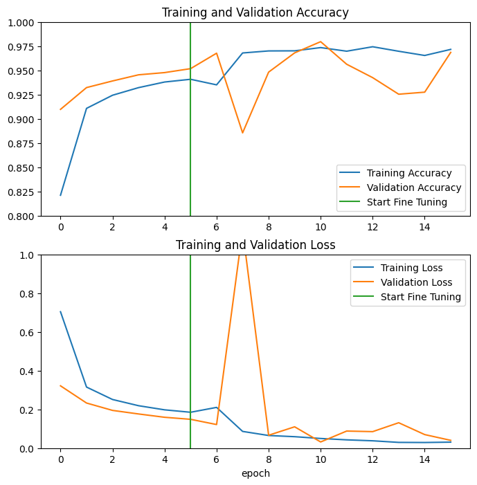
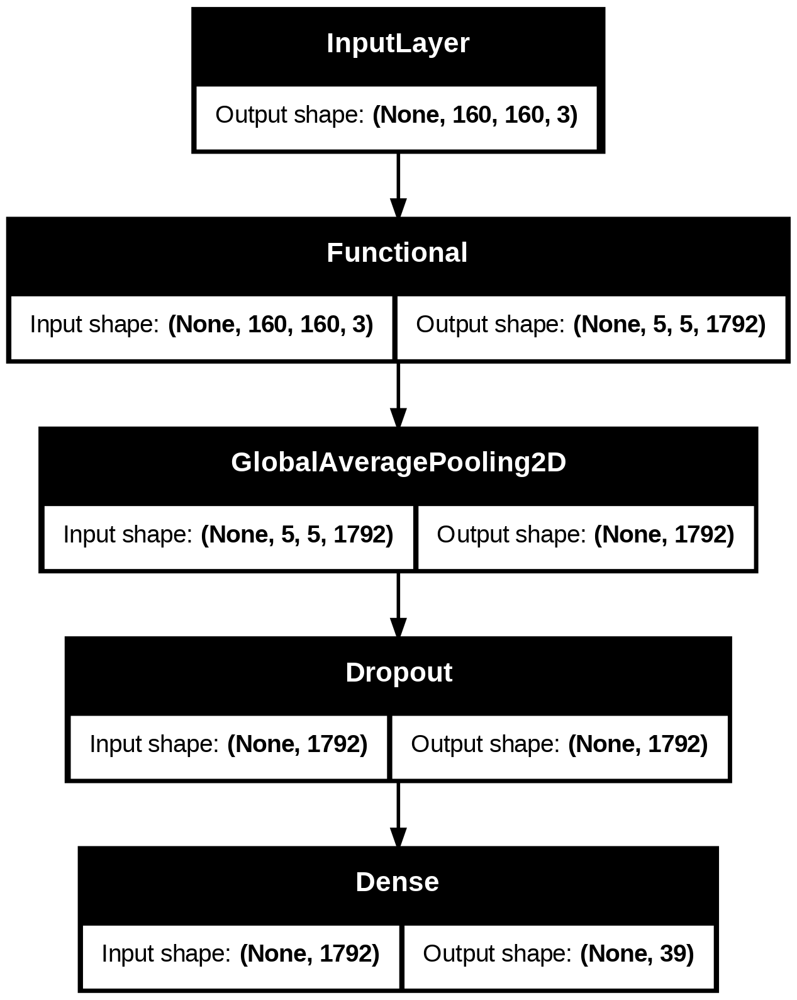
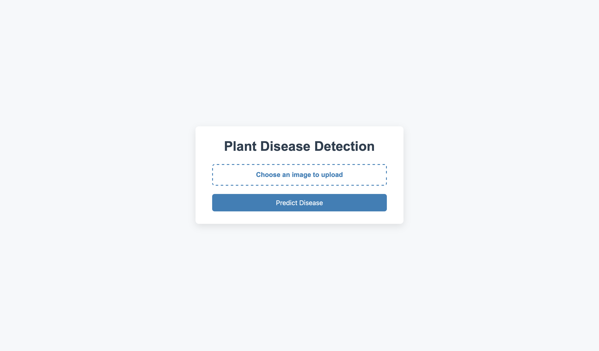

#  Plant Disease Detection System using Deep Learning

This project presents a **deep learning-based plant disease classification system** that uses transfer learning to identify plant leaf diseases from images. The system is designed for fast and accurate detection and includes a lightweight UI for ease of use.

##  Project Overview

Plant diseases can significantly reduce crop yield and quality. To help farmers and agriculturists detect diseases early, we built a system that:

- Accepts plant leaf images as input.
- Predicts the type of disease affecting the plant.
- Displays the predicted disease along with symptoms and suggested cure.

This project leverages **EfficientNetB4** via **Transfer Learning** from TensorFlow and is deployed via a Flask web application.

##  Key Features

-  EfficientNetB4-based model trained on the PlantVillage dataset.
-  Sample test images provided.
-  Visualization of training performance (Accuracy vs Loss).
-  JSON-based disease cure and symptoms lookup.
-  Web interface for real-time predictions.

---

##  Model Details

- **Model architecture:** EfficientNetB4
- **Framework:** TensorFlow / Keras
- **Technique used:** Transfer Learning
- **Training accuracy:** ~98%
- **Test accuracy:** ~95%

The model was trained using TensorFlow’s `tf.keras.applications.EfficientNetB4` and fine-tuned on the PlantVillage dataset.

🔗 **Reference for Model Architecture & Training**  
[Transfer Learning with TensorFlow Guide](https://www.tensorflow.org/tutorials/images/transfer_learning)

---


---

## 📊 Training Results







---

## 📁 Dataset

We used the **PlantVillage dataset**, which includes over 50,000 images of healthy and diseased plant leaves from various species such as tomato, apple, grape, etc.

📦 **Dataset Link:**  
🔗 [PlantVillage Dataset](https://github.com/salathegroup/plantvillage_deeplearning_paper_dataset)

🔬 **Analysis Code Reference:**  
🔗 [Training/Analysis Code](https://github.com/salathegroup/plantvillage_deeplearning_paper_analysis)

---

## 🧪 Sample Testing

You can test the model using images from the `sample_test_images/` folder or upload your own leaf images via the web interface.

---

## ⚙️ Installation

To run the project locally:

```bash
# Clone the repo
git clone https://github.com/yuvraj0412s/Plant--Disease-Detection-System.git
cd Plant--Disease-Detection-System

# (Optional) Create a virtual environment
python3 -m venv venv
source venv/bin/activate

# Install dependencies
pip install -r requirements.txt

# Run the web app
python app.py

